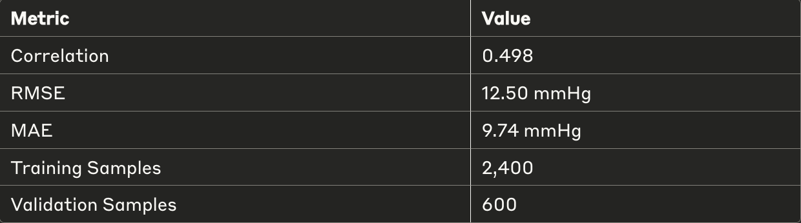
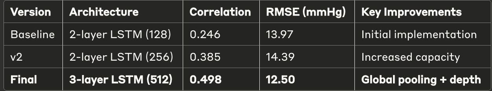

\# Pulse2Pressure 🫀→📊

***\*Deep Learning for Non-Invasive Blood Pressure Estimation\****

**Transform PPG pulse waveforms into accurate blood pressure predictions
using state-of-the-art LSTM networks.**

**🎯 Project Overview**

A deep learning approach for non-invasive blood pressure estimation from
photoplethysmography (PPG) signals using LSTM neural networks,
achieving:

- **Correlation**: 0.498 between predicted and actual SBP

- **RMSE**: 12.5 mmHg on 3,000 sample dataset

- **Clinical Relevance**: Suitable for continuous monitoring
  applications

**🚀 Key Features**

- **End-to-end ML Pipeline**: From raw PPG signals to blood pressure
  predictions

- **Iterative Model Improvement**: 103% correlation improvement through
  systematic optimization

- **Robust Architecture**: 3-layer LSTM with global average pooling

- **Production Ready**: Complete pre-processing, training, and
  evaluation framework

**📊 Results**

## 🚀 Run on Colab

Click the badge above to open and run the notebook in Google Colab (no local setup required).

**Prerequisites**

- Python 3.8+

- CUDA-capable GPU (recommended)

**📋 Requirements (requirements.txt)**

torch\>=2.0.0

torchvision\>=0.15.0

numpy\>=1.21.0

scikit-learn\>=1.0.0

matplotlib\>=3.5.0

tqdm\>=4.64.0

jupyter\>=1.0.0

pandas\>=1.3.0

**🏗️ Model Architecture**

python

SimplerImprovedLSTM(

(lstm): LSTM(1, 512, num_layers=3, batch_first=True, dropout=0.2)

(fc_layers): Sequential(

(0): Linear(512, 256)

(1): ReLU()

(2): Dropout(0.2)

(3): Linear(256, 128)

(4): ReLU()

(5): Dropout(0.15)

(6): Linear(128, 64)

(7): ReLU()

(8): Dropout(0.1)

(9): Linear(64, 1)

)

)

**Key Features:**

- 3-layer bidirectional LSTM with 512 hidden units

- Global average pooling across temporal dimension

- Progressive dropout regularization

- \~2.1M trainable parameters

**📈 Model Evolution**

**🔬 Technical Details**

**Data Preprocessing**

1.  **Min-Max Scaling**: Normalizes PPG and SBP to \[0,1\] range

2.  **Sequence Formatting**: Reshapes for LSTM input compatibility

3.  **Train-Test Split**: 80/20 stratified split

**Training Configuration**

- **Loss Function**: Mean Squared Error (MSE)

- **Optimizer**: Adam (lr=0.0003, weight_decay=1e-4)

- **Scheduler**: StepLR (γ=0.7, step_size=40)

- **Early Stopping**: Patience=20 epochs

- **Batch Size**: 32

**🎓 Clinical Significance**

The achieved RMSE of 12.5 mmHg demonstrates proof-of-concept for:

- **Continuous BP Monitoring**: Wearable device integration

- **Preventive Healthcare**: Early hypertension detection

- **Remote Patient Monitoring**: Telemedicine applications

**🚧 Future Enhancements**

- **Bias-aware loss functions** for systematic error reduction

- **Multi-modal fusion** with additional physiological signals

- **Attention mechanisms** for relevant PPG segment focus

- **Cross-population validation** for demographic robustness

**🤝 Contributing**

Contributions are welcome! Please feel free to submit a Pull Request.
For major changes, please open an issue first to discuss what you would
like to change.

1.  Fork the repository

2.  Create your feature branch (git checkout -b feature/AmazingFeature)

3.  Commit your changes (git commit -m \'Add some AmazingFeature\')

4.  Push to the branch (git push origin feature/AmazingFeature)

5.  Open a Pull Request

**👤 Author**

**\[KaleemMir\]**

- GitHub: [\@kaleem126](https://github.com/kaleem126)

- LinkedIn: [Kaleem
  Mir](https://www.linkedin.com/in/kaleem-mir-bb5a2828a/)

- Email: kaleemmir126@gmail.com

**🙏 Acknowledgments**

- Thanks to the open-source community for PyTorch and scikit-learn

- Inspiration from recent advances in physiological signal processing

- Medical domain expertise from cardiovascular research literature

⭐ **Star this repository if it helped you!**
